# Marketing Generator

A Trigger.dev-based workflow for automatically generating marketing content, specifically focused on glossary entries. The system uses PlanetScale as its database with Drizzle ORM for data management.

## Running the Glossary Generation Workflow

### Production Environment

The glossary generation workflow runs in Trigger.dev's production environment. To generate a new glossary entry:

1. **Access the Trigger.dev Dashboard**
   - URL: https://cloud.trigger.dev/orgs/unkey-9e78/projects/billing-IzvK/env/prod/test/tasks/generate_glossary_entry?tab=payload
   - This is the production environment where actual glossary entries are generated

2. **Provide the Payload**
   ```json
   {
     "term": "Your Term Here",
     "onCacheHit": "revalidate"
   }
   ```
   - Replace "Your Term Here" with the actual term (e.g., "Facade Pattern", "Retry Pattern", etc.)
   - The `onCacheHit` parameter controls cache behavior:
     - `"revalidate"`: Forces fresh generation even if cached data exists
     - `"stale"`: Uses cached data if available
     - `"bypass"`: Bypasses the cache entirely

3. **Run the Workflow**
   - Click "Run test" button (see screenshot: `/Users/richardpoelderl/Library/Caches/com.raycast.macos/Clipboard/b9b6ada452bd35b5bac6409c49f12952fe905de69d6af8f5390fbaaf340f300a.png`)
   - The workflow will start executing

### Development vs Production

- **Production (`prod`)**: Where actual glossary entries are generated
- **Test Environment (`test`)**: Used for testing local WIP changes separately from production

## Understanding the Workflow

The main workflow (`_generate-glossary-entry.ts`) orchestrates the generation of glossary entries through a series of sequential and parallel tasks. The workflow is idempotent and can be safely restarted if aborted.

### Workflow Steps

Based on the actual execution logs, here's the detailed workflow:

1. **Keyword Research** (`keyword_research`)
   - Performs search queries using the term
   - Fetches organic search results (typically 10 results)
   - Retrieves content from top 3 results using Firecrawl
   - Extracts keywords from titles and headers
   - Example output: 76 keywords for "Retry Pattern"

2. **Technical Research** (`technical_research`)
   - Runs multiple domain-specific searches in parallel:
     - **Official**: Standards bodies (IETF, W3C, ISO)
     - **Community**: Developer sites (StackOverflow, GitHub, Wikipedia)
     - **Neutral**: General technical resources (OWASP, MDN)
     - **Google**: General search results
   - Each search includes API cost tracking (e.g., $0.0115 per search)
   - Evaluates search results using AI to filter relevant content
   - Scrapes selected results for detailed content

3. **Outline Generation** (`generate_outline`)
   - Creates structured content outline
   - Performs technical evaluation (`perform_technical_eval`)
     - Generates accuracy, completeness, and clarity ratings
     - Creates technical recommendations
   - Performs SEO evaluation (`perform_seo_eval`)
     - Similar ratings for SEO aspects
     - SEO-specific recommendations
   - May retry on failure (with backoff delay)

4. **Parallel Processing**
   - Drafts content sections
   - Generates content takeaways
   - Both tasks run concurrently for efficiency

5. **SEO Optimization**
   - Generates meta tags
   - Creates SEO-optimized title and description

6. **FAQ Generation**
   - Creates relevant FAQs for the term
   - Stores in the database

7. **PR Creation**
   - Creates a GitHub PR with the generated content
   - Stores the PR URL in the database

## Database Schema

The system uses PlanetScale with Drizzle ORM. The main `entries` table stores:

- Basic content (title, description, sections)
- SEO metadata
- Technical research
- FAQs
- Content takeaways
- GitHub PR information
- Status tracking
- Timestamps

## Development Instructions

### For Humans

1. Start the development server:
   ```bash
   pnpm -F generator dev
   ```

2. The Trigger.dev server will run in the background
3. Access the Trigger.dev dashboard to monitor and manage workflows
4. Use the database studio to inspect data:
   ```bash
   pnpm -F generator db:studio
   ```

### For Agents

1. Start the development server with MCP support:
   ```bash
   pnpm -F generator dev:mcp
   ```

2. The Trigger.dev server will run in the background with MCP enabled
3. Make Trigger MCP calls to test specific workflow runs
4. Monitor the workflow execution through the Trigger.dev dashboard

### Analyzing Workflows

To understand the workflow structure:

1. **Task Identification**
   - Look for `task()` definitions in the codebase
   - Each task has a unique `id` and may have retry configurations

2. **Workflow Patterns**
   - **Sequential Tasks**: Tasks that run one after another
   - **Parallel Tasks**: Tasks that run concurrently ("in batch"), look for `import { batch } from "trigger.dev"` or find "`batch.trigger`" to find usages

3. **Task Dependencies**
   - Check for `triggerAndWait` or `trigger` calls to identify task dependencies
   - Look for error handling and abort conditions
   - Note the `onCacheHit` strategy for each task

4. **Database Interactions**
   - Tasks typically interact with the database through Drizzle ORM
   - Look for `db.query` and `db.insert` operations
   - Check for transaction handling

## Available Scripts

- `dev`: Start development server
- `dev:mcp`: Start development server with MCP support
- `trigger:deploy`: Deploy to Trigger.dev
- `db:push`: Push database schema changes
- `db:studio`: Open database studio
- `db:generate`: Generate database migrations
- `db:migrate`: Run database migrations
- `db:pull`: Pull database schema

## Dependencies

The project uses:
- Trigger.dev v4-beta for workflow orchestration
- PlanetScale for database
- Drizzle ORM for database operations
- Various AI SDKs for content generation
- GitHub integration for PR creation

## Notes

- The workflow is designed to be idempotent
- Each task has a maximum of 5 retry attempts
- Tasks use caching by default but can be forced to revalidate
- The system maintains a comprehensive audit trail of all operations

## Workflow Visualization

### Understanding the Task Hierarchy

The workflow in Trigger.dev is organized in levels, which represent the nesting and dependencies between tasks:

```mermaid

flowchart LR
    %% Entry point sticky note
    ENTRY["`📌 **ENTRY POINT**
    **generate_glossary_entry**
    ━━━━━━━━━━━━━━━━━━━━
    📥 term, onCacheHit
    📤 complete entry`"]

    %% Main Workflow as sticky notes
    subgraph WORKFLOW["🗂️ Main Workflow Steps"]
        direction LR
        
        %% Step 1: Research Phase
        S1["`📌 **Step 1: Research**
        ━━━━━━━━━━━━━━━━
        keyword_research
        ⬇️
        technical_research`"]
        
        %% Step 2: Content Structure
        S2["`📌 **Step 2: Structure**
        ━━━━━━━━━━━━━━━━
        generate_outline`"]
        
        %% Step 3: Content Generation
        S3["`📌 **Step 3: Generate**
        ━━━━━━━━━━━━━━━━
        draft_sections
        content_takeaways
        ⚡ parallel`"]
        
        %% Step 4: SEO & Metadata
        S4["`📌 **Step 4: SEO**
        ━━━━━━━━━━━━━━━━
        seo_meta_tags
        generate_faqs`"]
        
        %% Step 5: Publishing
        S5["`📌 **Step 5: Publish**
        ━━━━━━━━━━━━━━━━
        create_pr`"]
        
        %% Step 6: Review
        S6["`📌 **Step 6: Review**
        ━━━━━━━━━━━━━━━━
        PR Review
        Manual QA
        ✅ Merge`"]
        
        S1 --> S2 --> S3 --> S4 --> S5 --> S6
    end

    %% Sub-steps for each main step
    subgraph SUB1["keyword_research"]
        direction LR
        KR1[Search Query]
        KR2[Organic Results]
        KR3[Scrape Top 3]
        KR4[Extract Keywords]
        KR1 --> KR2 --> KR3 --> KR4
    end
    
    subgraph SUB2["technical_research"]
        direction LR
        TR1[exa_domain_search ×4]
        TR2[evaluate-search-results]
        TR3[scrape-search-results]
        TR1 --> TR2 --> TR3
    end
    
    subgraph SUB3["generate_outline"]
        GO1[Create Sections]
        GO2[perform_technical_eval]
        GO3[perform_seo_eval]
        GO1 --> GO2
        GO1 --> GO3
    end
    
    subgraph SUB4["draft_sections"]
        direction LR
        DS1[GPT-4 Draft]
        DS2[Review & Optimize]
        DS1 --> DS2
    end
    
    subgraph SUB5["content_takeaways"]
        direction LR
        CT1[Analyze Content]
        CT2[Extract Insights]
        CT1 --> CT2
    end
    
    subgraph SUB6["seo_meta_tags"]
        direction LR
        SEO1[Fetch Keywords]
        SEO2[Get Top 10 Pages]
        SEO3[GPT-4 Craft Tags]
        SEO4[Validate Lengths]
        SEO1 --> SEO2 --> SEO3 --> SEO4
    end
    
    subgraph SUB7["generate_faqs"]
        direction LR
        FAQ1[Get People Also Ask]
        FAQ2[GPT-4 Generate Answers]
        FAQ3[Store FAQs]
        FAQ1 --> FAQ2 --> FAQ3
    end
    
    subgraph SUB8["create_pr"]
        direction LR
        PR1[Check Existing PR]
        PR2[Prepare MDX]
        PR3[Branch Logic]
        PR4[Create/Update PR]
        PR1 --> PR2 --> PR3 --> PR4
    end

    %% Database Layer
    subgraph DATABASE["💾 Database Layer"]
        direction LR
        
        DB_RESEARCH[("`**Research Data**
        • keywords
        • technicalResearch
        • exaScrapedResults`")]
        
        DB_STRUCTURE[("`**Content Structure**
        • sections
        • evaluations`")]
        
        DB_CONTENT[("`**Generated Content**
        • dynamicSectionsContent
        • contentTakeaways`")]
        
        DB_META[("`**SEO & Metadata**
        • metaTitle
        • metaDescription
        • faqs`")]
        
        DB_FINAL[("`**Final Output**
        • githubPrUrl
        • status: completed`")]
    end
    
    %% Connections
    ENTRY --> S1
    
    %% Connect main steps to sub-steps
    S1 -.->|expands| SUB1
    S1 -.->|expands| SUB2
    S2 -.->|expands| SUB3
    S3 -.->|expands| SUB4
    S3 -.->|expands| SUB5
    S4 -.->|expands| SUB6
    S4 -.->|expands| SUB7
    S5 -.->|expands| SUB8
    
    %% Workflow to Database connections
    S1 -.->|"stores"| DB_RESEARCH
    S2 -.->|"stores"| DB_STRUCTURE
    S3 -.->|"stores"| DB_CONTENT
    S4 -.->|"stores"| DB_META
    S5 -.->|"stores"| DB_FINAL
    
    %% Database feeds next steps
    DB_RESEARCH -.->|"feeds"| S2
    DB_STRUCTURE -.->|"feeds"| S3
    DB_CONTENT -.->|"feeds"| S4
    DB_META -.->|"feeds"| S5
    DB_FINAL -.->|"feeds"| S6
    
    %% Styles
    classDef stickyNote fill:#fff9c4,stroke:#f57c00,stroke-width:2px,color:#000
    class ENTRY,S1,S2,S3,S4,S5,S6 stickyNote
    
    classDef database fill:#e1f5fe,stroke:#01579b,stroke-width:2px,color:#000
    class DB_RESEARCH,DB_STRUCTURE,DB_CONTENT,DB_META,DB_FINAL database
    
    classDef container fill:#f5f5f5,stroke:#333,stroke-width:3px,color:#000
    class WORKFLOW,DATABASE container
    
    classDef substep fill:#e8f5e9,stroke:#2e7d32,stroke-width:1px,color:#000
    class SUB1,SUB2,SUB3,SUB4,SUB5,SUB6,SUB7,SUB8 substep

```


### Task Organization

Tasks can be:
- **Sequential**: Running one after another (indicated by `triggerAndWait`)
- **Parallel**: Running concurrently (using `batch.triggerByTaskAndWait`)
- **Nested**: Sub-tasks that run within parent tasks

### Monitoring Workflow Execution

1. **Logs**: Available in both JSON format and visual representation in the Trigger.dev dashboard
2. **Levels**: Indicate task hierarchy - higher levels are nested deeper
3. **Status**: Each task shows its execution status (executing, completed, failed)
4. **Duration**: Time taken for each task to complete
5. **Cost Tracking**: API costs are logged for external service calls (Exa, AI generation)

### Understanding Execution Logs

The workflow logs provide detailed insights:

#### Key Log Elements
- **Run Information**:
  - `id`: Unique identifier for the run
  - `status`: Current state (e.g., "WAITING_TO_RESUME", "completed")
  - `environment`: Shows if running in PRODUCTION or TEST

- **Timeline Events**:
  - **Dequeued**: Task picked up from queue
  - **Launched**: Process created to run the task
  - **Importing task file**: Task file loaded
  - **Execution**: Actual task logic running

- **Cost Tracking Examples**:
  ```
  💰 Exa API costs for the "Official" domain search:
      Total: $0.0115 
      Search: $0.0025 (@$0.0025/request)
  
  💸 Token usage: 7269 tokens
      INPUT: $0.000334425
      OUTPUT: $0.000843
      TOTAL: $0.001177425
  ```

#### Error Handling
- Tasks have retry logic with exponential backoff
- Example: "Retry #2 delay" shows automatic retry after failure
- Errors include full stack traces for debugging

#### Performance Metrics
- Each task logs duration in nanoseconds
- Parallel tasks show concurrent execution
- Store operations (upload/download) are tracked separately

## Testing

### Trigger.dev

#### Instructions

1. Run the following command in a background terminal:
   ```bash
   pnpm -F generator dev:mcp
   ```
   - **Wait until you see:**
     `Trigger.dev MCP Server is now running on port <PORT>`
   - The default port may be `3333` (as shown in logs)
   - **Example logs for successful operation**

   ```bash
   pnpm -F generator dev:mcp

   > generator@1.0.0 dev:mcp /Users/richardpoelderl/marketing-1/apps/generator 
   > pnpm dlx trigger.dev@v4-beta dev --mcp

   Trigger.dev (4.0.0-v4-beta.21)
   ------------------------------------------------------
   Key: Version | Task | Run
   ------------------------------------------------------
   Trigger.dev MCP Server is now running on port 3333 ✨
   ○ Building background worker…
   │
   ■  Error: (node:9267) [DEP0040] DeprecationWarning: The `punycode` module is deprecated. Please use a userland alternative instead.
   │  (Use `node --trace-deprecation ...` to show where the warning was created)
   │  
   ○ Background worker ready [node] -> 20250613.2 | Test tasks | View runs
   ```
2. Use the trigger.dev MCP to list its tool calls.

Successful operation:

You should see a list of available tasks in the response, similar to this:
```
Parameters:
 No parameters

Result: 

[ 
  "...",
  "...",
  "...",
] 
```

## Task Reference Guide

### Core Tasks

#### 1. generate_glossary_entry (Main Orchestrator)
- **Purpose**: Orchestrates the entire glossary generation workflow
- **Retry**: 0 attempts (relies on subtask retries)
- **Cache Behavior**: Checks for complete entry before proceeding
- **Error Handling**: Uses `AbortTaskRunError` for failed subtasks

#### 2. keyword_research
- **Purpose**: Discovers relevant keywords for the term
- **Retry**: 3 attempts
- **Key Operations**:
  - Generates optimized search query
  - Fetches organic search results via Serper API
  - Scrapes top 3 results with Firecrawl
  - Extracts keywords from titles and headers
- **Cost**: ~$0.02-0.05 per run (Serper + Firecrawl)

#### 3. technical_research
- **Purpose**: Gathers authoritative technical content
- **Parallel Execution**: 4 domain searches run concurrently
- **Domain Categories**:
  - Official (IETF, W3C, ISO)
  - Community (StackOverflow, GitHub, Wikipedia)
  - Neutral (OWASP, MDN)
  - Google (general search)
- **Cost**: ~$0.05-0.10 per run (Exa API + AI evaluation)

#### 4. generate_outline
- **Purpose**: Creates content structure with evaluations
- **Retry**: 3 attempts (can be flaky)
- **Evaluations**:
  - Technical (accuracy, completeness, clarity)
  - SEO (keyword optimization)
  - Editorial (if applicable)
- **Known Issues**: Memory-intensive, may need splitting

#### 5. draft_sections & content_takeaways
- **Purpose**: Generate main content and insights
- **Execution**: Can run in parallel for efficiency
- **Content Limits**: Up to 6 dynamic sections
- **AI Model**: GPT-4-turbo for quality

#### 6. seo_meta_tags
- **Purpose**: Optimizes for search engines
- **Character Limits**:
  - Title: max 60 (target 45-50)
  - Description: max 160 (target 140-145)
  - H1: max 80 (target 45-50)

#### 7. create_pr
- **Purpose**: Creates GitHub pull request
- **Retry**: 0 attempts
- **Smart Features**:
  - Detects identical files
  - Updates existing PRs
  - Handles branch conflicts

## Tips for Engineers

### Working with the Workflow

1. **Cache Strategy**:
   - Use `"stale"` for development to save on API costs
   - Use `"revalidate"` for production to ensure fresh content
   - Use `"bypass"` when debugging cache-related issues

2. **Monitoring Best Practices**:
   - Check the Trigger.dev dashboard for real-time execution status
   - Look for failed tasks and retry patterns
   - Monitor API costs to optimize usage

3. **Debugging**:
   - Each task has detailed logs with timestamps
   - Check the "exception" events for error details
   - Use task levels to understand execution flow

4. **Performance Optimization**:
   - Parallel tasks (using `batch`) significantly reduce total execution time
   - The technical research phase runs 4 domain searches concurrently
   - Content generation and takeaways run in parallel

5. **Database Considerations**:
   - All data is persisted to PlanetScale
   - Check for existing entries before triggering new generations
   - Use `db:studio` to inspect data directly

6. **Task Dependencies**:
   - `triggerAndWait` ensures dependent tasks complete before proceeding
   - The workflow is designed to be resumable if interrupted
   - Each task stores its output for subsequent tasks to use