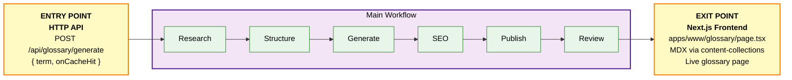

# Marketing Generator

A server-based workflow for automatically generating marketing content, specifically focused on glossary entries (see e.g. [circuit breaker](https://unkey.com/glossary/api-circuit-breaker)). The system uses PostgreSQL as its database with Drizzle ORM for data management, and is deployed as a Docker container via Unkey Deploy.

**Table of Contents**
- [1. Running the Generator](#1-running-the-generator)
  - [API Endpoints](#api-endpoints)
  - [Local Development](#local-development)
  - [Docker](#docker)
  - [Environment Variables](#environment-variables)
- [2. Understanding the Workflow](#2-understanding-the-workflow)
  - [Workflow Visualization](#workflow-visualization)     
    - [Quick Overview](#quick-overview)
    - [Detailed Workflow](#detailed-workflow)     
    - [Architecture Layers](#architecture-layers)
  - [Workflow Steps](#workflow-steps)
- [3. Database Schema](#3-database-schema)
- [4. Available Scripts](#4-available-scripts)
- [5. Dependencies](#5-dependencies)
- [6. Notes](#6-notes)
- [7. Tips for Engineers](#7-tips-for-engineers)
  - [Working with the Workflow](#working-with-the-workflow)
- [8. How to come up with glossary terms](#8-how-to-come-up-with-glossary-terms)

___

## 1. Running the Generator

### API Endpoints

The generator exposes the following HTTP endpoints:

| Method | Path | Description |
|--------|------|-------------|
| `GET` | `/health` | Health check |
| `POST` | `/api/glossary/generate` | Generate a glossary entry (uses cache by default) |
| `POST` | `/api/glossary/regenerate` | Force regenerate a glossary entry (bypasses cache) |

**Generate a glossary entry:**
```bash
curl -X POST https://your-deployment-url/api/glossary/generate \
  -H "Content-Type: application/json" \
  -d '{
    "term": "API Gateway",
    "onCacheHit": "stale"
  }'
```

**Force regenerate:**
```bash
curl -X POST https://your-deployment-url/api/glossary/regenerate \
  -H "Content-Type: application/json" \
  -d '{
    "term": "API Gateway"
  }'
```

**Request body:**

| Field | Type | Required | Description |
|-------|------|----------|-------------|
| `term` | `string` | Yes | The glossary term to generate content for |
| `onCacheHit` | `"stale" \| "revalidate"` | No | Cache strategy. Defaults to `"stale"` |

- `"stale"`: Uses cached data if available (saves API costs)
- `"revalidate"`: Forces fresh generation even if cached data exists

The `/api/glossary/regenerate` endpoint always uses `"revalidate"` regardless of the body.

### Local Development

```bash
# Install dependencies
pnpm install

# Start the dev server with hot reload
pnpm dev
```

The server starts on port `3069` by default (configurable via `PORT` env var).

### Docker

```bash
# Build the image
docker build -t generator .

# Run the container
docker run -p 3069:3069 --env-file .env generator
```

For Unkey Deploy, push the Docker image and configure the environment variables in the deployment dashboard.

### Environment Variables

| Variable | Description |
|----------|-------------|
| `PORT` | Server port (default: `3069`) |
| `NODE_ENV` | `"production"` or `"development"` |
| `DATABASE_URL` | PostgreSQL connection string |
| `OPENAI_API_KEY` | OpenAI API key (GPT-4o-mini, GPT-4-turbo) |
| `GEMINI_API_KEY` | Google Gemini API key (fallback LLM) |
| `FIRECRAWL_API_KEY` | Firecrawl API key (web scraping) |
| `SERPER_API_KEY` | Serper API key (search results) |
| `EXA_API_KEY` | Exa API key (technical research) |
| `GITHUB_PERSONAL_ACCESS_TOKEN` | GitHub PAT (PR creation) |

## 2. Understanding the Workflow

The main workflow (`generate-glossary-entry.ts`) orchestrates the generation of glossary entries through a series of sequential steps. Each step is a plain async function with built-in retry logic. The workflow is idempotent and can be safely restarted if it fails partway through.

### Workflow Visualization

#### Quick Overview
The glossary generation workflow transforms a term into a published glossary page:



#### Detailed Workflow
Dive deeper into the three-layer architecture:

```mermaid

flowchart LR
    %% Entry point sticky note
    ENTRY["`**ENTRY POINT**
    **HTTP API**
    POST /api/glossary/generate
    { term, onCacheHit }`"]

    %% Main Workflow as sticky notes
    subgraph WORKFLOW["Main Workflow Steps"]
        direction LR

        %% Step 1: Research Phase
        S1["`**Step 1: Research**
        keyword_research
        technical_research`"]

        %% Step 2: Content Structure
        S2["`**Step 2: Structure**
        generate_outline`"]

        %% Step 3: Content Generation
        S3["`**Step 3: Generate**
        draft_sections
        content_takeaways`"]

        %% Step 4: SEO & Metadata
        S4["`**Step 4: SEO**
        seo_meta_tags
        generate_faqs`"]

        %% Step 5: Publishing
        S5["`**Step 5: Publish**
        create_pr`"]

        %% Step 6: Review
        S6["`**Step 6: Review**
        PR Review
        Manual QA
        Merge`"]

        S1 --> S2 --> S3 --> S4 --> S5 --> S6
    end

    %% Exit point
    EXIT["`**EXIT POINT**
    **Next.js Frontend**
    apps/www/glossary/page.tsx
    MDX via content-collections
    Live glossary page`"]

    %% Sub-steps for each main step
    subgraph SUB1["keyword_research"]
        direction LR
        KR1[Search Query]
        KR2[Organic Results]
        KR3[Scrape Top 3]
        KR4[Extract Keywords]
        KR1 --> KR2 --> KR3 --> KR4
    end

    subgraph SUB2["technical_research"]
        direction LR
        TR1[exa_domain_search x4]
        TR2[evaluate_search_results]
        TR3[scrape_search_results]
        TR1 --> TR2 --> TR3
    end

    subgraph SUB3["generate_outline"]
        direction LR
        GO1[generateInitialOutline]
        GO2[perform_technical_eval]
        GO3[perform_seo_eval]
        GO4[reviseSEOOutline]
        GO5[perform_editorial_eval]
        GO6[reviseEditorialOutline]
        GO7[Save Outline]
        GO1 --> GO2
        GO1 --> GO3 --> GO4 --> GO5 --> GO6 --> GO7
    end

    subgraph SUB4["draft_sections"]
        direction LR
        DS1[draftSections]
        DS2["`reviewContent
        (with technical_research)`"]
        DS3["`seoOptimizeContent
        (with keyword_research)`"]
        DS1 --> DS2 --> DS3
    end

    subgraph SUB5["content_takeaways"]
        direction LR
        CT0[Fetch Technical Research]
        CT1[Analyze Content]
        CT2[Extract Insights]
        CT0 --> CT1 --> CT2
    end

    subgraph SUB6["seo_meta_tags"]
        direction LR
        SEO1[Fetch Keywords]
        SEO2[Get Top 10 Pages]
        SEO3[GPT-4 Craft Tags]
        SEO4[Validate Lengths]
        SEO1 --> SEO2 --> SEO3 --> SEO4
    end

    subgraph SUB7["generate_faqs"]
        direction LR
        FAQ1[Get People Also Ask]
        FAQ2[GPT-4 Generate Answers]
        FAQ3[Store FAQs]
        FAQ1 --> FAQ2 --> FAQ3
    end

    subgraph SUB8["create_pr"]
        direction LR
        PR1[Check Existing PR]
        PR2[Prepare MDX]
        PR3[Branch Logic]
        PR4[Create/Update PR]
        PR1 --> PR2 --> PR3 --> PR4
    end

    %% Database Layer
    subgraph DATABASE["Database Layer"]
        direction LR

        DB_RESEARCH[("`**Research Data**
        keywords
        technicalResearch
        exaScrapedResults`")]

        DB_STRUCTURE[("`**Content Structure**
        sections
        evaluations`")]

        DB_CONTENT[("`**Generated Content**
        dynamicSectionsContent
        contentTakeaways`")]

        DB_META[("`**SEO & Metadata**
        metaTitle
        metaDescription
        faqs`")]

        DB_FINAL[("`**Final Output**
        githubPrUrl
        status: completed`")]
    end

    %% Connections
    ENTRY --> S1
    S6 --> EXIT

    %% Connect main steps to sub-steps
    S1 -.->|expands| SUB1
    S1 -.->|expands| SUB2
    S2 -.->|expands| SUB3
    S3 -.->|expands| SUB4
    S3 -.->|expands| SUB5
    S4 -.->|expands| SUB6
    S4 -.->|expands| SUB7
    S5 -.->|expands| SUB8

    %% Workflow to Database connections
    S1 -.->|"stores"| DB_RESEARCH
    S2 -.->|"stores"| DB_STRUCTURE
    S3 -.->|"stores"| DB_CONTENT
    S4 -.->|"stores"| DB_META
    S5 -.->|"stores"| DB_FINAL

    %% Database feeds next steps
    DB_RESEARCH -.->|"feeds"| S2
    DB_STRUCTURE -.->|"feeds"| S3
    DB_CONTENT -.->|"feeds"| S4
    DB_META -.->|"feeds"| S5
    DB_FINAL -.->|"feeds"| S6

    %% Styles
    classDef stickyNote fill:#fff9c4,stroke:#f57c00,stroke-width:2px,color:#000
    class ENTRY,S1,S2,S3,S4,S5,S6,EXIT stickyNote

    classDef database fill:#e1f5fe,stroke:#01579b,stroke-width:2px,color:#000
    class DB_RESEARCH,DB_STRUCTURE,DB_CONTENT,DB_META,DB_FINAL database

    classDef container fill:#f5f5f5,stroke:#333,stroke-width:3px,color:#000
    class WORKFLOW,DATABASE container

    classDef substep fill:#e8f5e9,stroke:#2e7d32,stroke-width:1px,color:#000
    class SUB1,SUB2,SUB3,SUB4,SUB5,SUB6,SUB7,SUB8 substep

```



#### Architecture Layers

**Layer 1: Main Workflow** (Yellow sticky notes)
- Sequential steps from research to review

**Layer 2: Sub-Steps** (Green boxes)
- Plain async functions with built-in retry logic via `withRetry()`
- Vercel AI SDK is used for LLM calls (drafting, generation & LLM as a judge)

**Layer 3: Database** (Blue cylinders)
- Data persistence between steps
- This is the `marketing` database in PostgreSQL
- The schema is defined with Drizzle


### Workflow Steps

Based on the actual execution flow, here's the detailed workflow:

1. **Keyword Research** (`keywordResearchStep`)
   - Performs search queries using the term
   - Fetches organic search results (typically 10 results)
   - Retrieves content from top 3 results using Firecrawl
   - Extracts keywords from titles and headers
   - Example output: 76 keywords for "Retry Pattern"

2. **Technical Research** (`technicalResearchStep`)
   - Runs multiple domain-specific searches in parallel via `Promise.allSettled`:
     - **Official**: Standards bodies (IETF, W3C, ISO)
     - **Community**: Developer sites (StackOverflow, GitHub, Wikipedia)
     - **Neutral**: General technical resources (OWASP, MDN)
     - **Google**: General search results
   - Each search includes API cost tracking (e.g., $0.0115 per search)
   - Evaluates search results using AI to filter relevant content
   - Scrapes selected results for detailed content

3. **Outline Generation** (`generateOutlineStep`)
   - Creates structured content outline
   - Performs technical evaluation
     - Generates accuracy, completeness, and clarity ratings
     - Creates technical recommendations
   - Performs SEO evaluation
     - Similar ratings for SEO aspects
     - SEO-specific recommendations
   - Performs editorial evaluation and revision
   - Retries up to 5 times on failure

4. **Content Generation**
   - Drafts content sections (`draftSectionsStep`)
   - Generates content takeaways (`contentTakeawaysStep`)

5. **SEO Optimization**
   - Generates meta tags (`seoMetaTagsStep`)
   - Creates SEO-optimized title and description

6. **FAQ Generation** (`generateFaqsStep`)
   - Creates relevant FAQs for the term
   - Stores in the database

7. **PR Creation** (`createPrStep`)
   - Creates a GitHub PR with the generated content
   - Stores the PR URL in the database

## 3. Database Schema

The system uses PostgreSQL with Drizzle ORM. The main `entries` table stores:

- Basic content (title, description, sections)
- SEO metadata
- Technical research
- FAQs
- Content takeaways
- GitHub PR information
- Status tracking
- Timestamps

## 4. Available Scripts

| Script | Description |
|--------|-------------|
| `pnpm dev` | Start dev server with hot reload (tsx watch) |
| `pnpm build` | Compile TypeScript to `dist/` |
| `pnpm start` | Run compiled production server |
| `pnpm db:push` | Push database schema changes |
| `pnpm db:studio` | Open Drizzle database studio |
| `pnpm db:generate` | Generate database migrations |
| `pnpm db:migrate` | Run database migrations |
| `pnpm db:pull` | Pull database schema |

## 5. Dependencies

The project uses:
- **Hono** for the HTTP server
- **PostgreSQL** for the database
- **Drizzle ORM** for database operations
- **Vercel AI SDK** with OpenAI and Google Gemini for content generation
- **Exa** for technical research searches
- **Firecrawl** for web scraping
- **Serper** for search results
- **Octokit** for GitHub PR creation

## 6. Notes

- The workflow is designed to be idempotent
- Each step has configurable retry attempts via the `withRetry()` utility
- Steps use caching by default but can be forced to revalidate
- The system maintains a comprehensive audit trail of all operations in the database
- The server runs on port 3069 by default

## 7. Tips for Engineers

### Working with the Workflow

1. **Cache Strategy**:
   - Use `"stale"` for development to save on API costs
   - Use `"revalidate"` (or the `/regenerate` endpoint) for production to ensure fresh content

2. **Monitoring**:
   - Check server logs for real-time execution status
   - Each step logs its progress with timestamps
   - API costs are tracked and logged for external services

3. **Debugging**:
   - Each step has detailed console logs
   - Failed steps will log error details before retrying
   - Use the `/health` endpoint to verify the server is running

4. **Performance**:
   - The technical research phase runs 4 domain searches concurrently via `Promise.allSettled`
   - Database caching prevents redundant API calls across restarts
   - Retry logic uses exponential backoff to handle transient failures

5. **Database Considerations**:
   - All data is persisted to PostgreSQL
   - Check for existing entries before triggering new generations
   - Use `pnpm db:studio` to inspect data directly

6. **Deployment**:
   - Build the Docker image and deploy to Unkey Deploy
   - Ensure all environment variables are configured
   - The server is stateless; all state lives in PostgreSQL

## 8. How to come up with glossary terms

If you have some API development related terms that you think are missing, use them.

Otherwise, this is one way you could come up with ideas:
1. **Gather keyword data.**
    * Go into the search console's [Performance Report](https://search.google.com/search-console/performance/search-analytics?resource_id=sc-domain%3Aunkey.com) and select `Queries`
    * Display 100 keywords on the page
    * Filter out queries containing `unkey`
    * Copy 100 entries
2. **Prompt your LLM of choice.**
    * This could be Claude, ChatGPT or whatever you work with
    * Prompt it to propose 10 technical terms related to API development, drawing inspiration from below keyword data
    * Insert the keyword data from step 1
3. **Cross-check existing glossary entries.**
    * You can [search the marketing repository](https://github.com/search?q=repo%3Aunkeyed%2Fmarketing%20gateway&type=code) for your term to see if an `.mdx` file already exists
4. **Repeat steps 2 & 3 until you have enough terms.**
5. **Generate the entry.**
    * Send a POST request to the `/api/glossary/generate` endpoint with your term

## 9. Troubleshooting

Since LLMs generate our outputs, generations may fail. Each step has built-in retry logic with exponential backoff, but if issues persist:

1. **Check the logs** - The server logs detailed progress for each step. Look for error messages to identify which step failed.
2. **Retry the request** - The workflow is idempotent. Sending the same request again will resume from where cached data exists.
3. **Force regenerate** - Use the `/api/glossary/regenerate` endpoint to bypass all caches and start fresh.
4. **Check external services** - Failures are often caused by rate limits on OpenAI, Exa, Firecrawl, or Serper. Wait and retry.
5. **Inspect the database** - Use `pnpm db:studio` to check what data was persisted before the failure.
